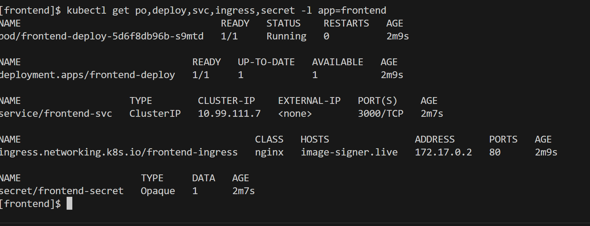

# Image Signer

A full‑stack microservice application that lets users upload an image and a custom text, then receives a signed (water‑marked) version back.The project is split into a Next.js (TypeScript) frontend, a Node.js (TypeScript) API gateway, and a Python consumer that creates the image. MongoDB, RabbitMQ, Cloudinary, and an SMTP mailer bring everything together.

The microservices are orchestrated using Kubernetes with Ingress routing for easy access.

[]

## Kubernetes Concepts

Short notes on the key Kubernetes resources used in this project:

### Pod

A Pod is the smallest deployable unit in Kubernetes. It can contain one or more containers that share storage, network, and a specification.

### Deployment

A Deployment ensures a specified number of identical Pods are running. It manages rolling updates, scaling, and rollback.

### StatefulSet

Used to manage stateful applications. Unlike Deployments, each pod in a StatefulSet has a persistent identity and stable storage.

### Service

A Service exposes a set of Pods as a network service. It abstracts pod IPs with a stable name and supports load balancing across pods.

### Ingress

Ingress manages external access to services, typically HTTP. It allows routing based on hostname and path, using rules and optionally TLS.

### ConfigMap

A ConfigMap holds configuration data in key-value pairs. It can be injected into pods as environment variables or mounted as files.

### Secret

A Secret is similar to a ConfigMap but designed to hold sensitive data like passwords, API keys, or TLS certificates.

## Prerequisites

- Docker Desktop (with Kubernetes enabled)
- kubectl
- Helm
- minikube
- python
- nodejs

## Setup Instructions

1.  Clone the repository:

    ```bash
    $ git clone https://github.com/bosukeme/image-signer-microservice.git
    $ cd image-signer-microservice
    ```

2.  Deploy RabbitMQ

    ```
    $ cd manifests/rabbitMQ
    $ kubectl apply -f .
    ```

    This creates a statefulset, a persistent volume claim, a service and an ingress resource for rabbitmq

    Verify if the resources were created successfully:

    ```
    $ kubectl get po,statefulset,svc,ingress -l app=rabbitmq
    ```

    <br/>
    

    You can view the management URL for the deployed Rabbitmq using the ingress link
    `http://rabbitmq-manager.com/`
    username: guest
    password: guest

3.  Deploy NextJS Frontend.
    (Open a new terminal)

    ```
    $ cd manifests/frontend
    ```

    note: You will have to run the command below to create a secret resource.
    Create a .env file having `NEXT_PUBLIC_API_BASE_URL=http://node-server.live` where `http://node-server.live` is the URL of the node server to be created in step 4

    ```
    $ kubectl create secret generic frontend-secret --from-env-file=.env --dry-run=client -o yaml > frontend-secret.yaml
    ```

    Edit the deployment yaml file (frontend-deploy.yaml) and update the image name with the image you created <a href="https://github.com/bosukeme/image-signer-microservice/tree/main/frontend">here </a>

    ```
    $ kubectl apply -f .
    ```

    This creates a deployment, a service, a secret, and an ingress resource for the nextjs frontend

    Verify if the resources were created successfully:

    ```
    $ kubectl get po,deploy,svc,ingress,secret -l app=frontend
    ```

    <br/>
    

    You can view the deployed NextJs frontend using the ingress link
    `http://image-signer.live`

4.  Deploy NodeJS Server.
    (Open a new terminal)

    ```
    $ cd manifests/node_server
    ```

    note: You will have to run the command below to create a secret resource.
    Create a .env file having `MONGO_URI=<your mongo connection string>`

    ```
    $ kubectl create secret generic node-server --from-env-file=.env --dry-run=client -o yaml > node-server-secret.yaml
    ```

    Edit the deployment yaml file (node-server-deploy.yaml) and update the image name with the image you created <a href="https://github.com/bosukeme/image-signer-microservice/tree/main/node_server">here </a>

    ```
    $ kubectl apply -f .
    ```

    This creates a deployment, a service, a secret, a configmap, and an ingress resource for the node server

    Verify if the resources were created successfully:

    ```
    $ kubectl get po,deploy,svc,ingress,secret,cm -l app=node-server
    ```

    <br/>
    

    You can view the deployed nodejs express app using the ingress link
    `http://node-server.live`

    #### add image here

5.  Deploy Python Consumer.
    (Open a new terminal)

    ```
    $ cd manifests/python_consumer
    ```

    note: You will have to run the command below to create a secret resource.
    Create a .env file having

    ```
        CLOUDINARY_CLOUD_NAME=<cloudinary api name>
        CLOUDINARY_API_KEY=<cloudinary api key>
        CLOUDINARY_API_SECRET=<cloudinary api secret>
        GMAIL_ADDRESS=<gmail address>
        GMAIL_PASSWORD=<gmail app password>
        MONGO_URL=<mongo url>
        DB_NAME=imageSigner
        COL_NAME=imagesigners
    ```

    ```
    $ kubectl create secret generic python-consumer --from-env-file=.env --dry-run=client -o yaml > python-consumer-secret.yaml
    ```

    Edit the deployment yaml file (python-consumer-deploy.yaml) and update the image name with the image you created <a href="https://github.com/bosukeme/image-signer-microservice/tree/main/python_consumer">here </a>

    ```
    $ kubectl apply -f .
    ```

    This creates a deployment, a secret, and a configmap resource for the python consumer

    Verify if the resources were created successfully:

    ```
    $ kubectl get po,deploy,secret,cm -l app=python-consumer
    ```

    <br/>
    

6.  Setup Minikube Tunnel: <br />
    Open a new terminal and run:

    ```
    $ minikube tunnel --bind-address 0.0.0.0
    ```

7.  Set up `/etc/hosts`:

        ```
        # Linux / MacOs
        $ minikube ip

        # Windows (WSL)
        $ hostname -I
        ```
        Edit `/etc/hosts`  (Linux/MacOS) or `c\windows\system32\drivers\etc\hosts` (Windows). <br/>
        Add `<ipaddress from the above step>   	url` <br/>
        * Example
        ```
        172.29.204.16     	image-signer.live node-server.live rabbitmq-manager.com
        ```
        <br/>

    <br>

8.  Possible troubleshooting: <br>

    If you are unable to access the endpoint:

    - Restart Minikube Tunnel:

    ```
    $ sudo pkill -f "minikube tunnel"
    $ minikube tunnel --bind-address 0.0.0.0
    ```

    - Ensure the Ingress Controller IP type is `LoadBalancer`:

    ```
    $ kubectl patch svc ingress-nginx-controller -n ingress-nginx -p '{"spec": {"type": "LoadBalancer"}}'
    ```

    - Enable Ingress:

    ```
    $ minikube addons enable ingress
    ```

    - Use localhost instead. This will return a list of localhost url for a particular service

    ```
    $ minikube service list
    ```

## Cleanup

- kubectl delete -f manifest/frontend/
- kubectl delete -f manifest/node-server/
- kubectl delete -f manifest/python-consumer/
- kubectl delete -f manifest/rabbitmq/

## Contributing

If you would like to contribute, please follow these steps:

- Fork the repository.
- Create a new branch for your feature or bugfix.
- Submit a pull request.

## Authors

Ukeme Wilson

- <a href="https://www.linkedin.com/in/ukeme-wilson-4825a383/">Linkedin</a>.
- <a href="https://medium.com/@ukemeboswilson">Medium</a>.
- <a href="https://www.ukemewilson.sbs/">Website</a>.
